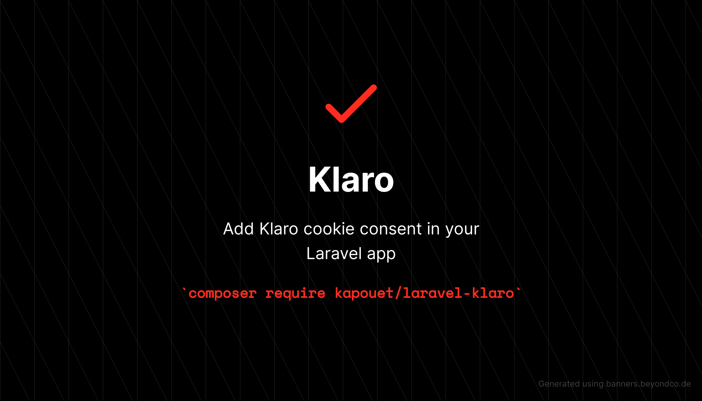

[](https://packagist.org/packages/kapouet/laravel-klaro)
[](https://github.com/kapouet/laravel-klaro/actions?query=workflow%3ATests+branch%3Amaster)
[](https://github.com/kapouet/laravel-klaro/actions?query=workflow%3A"Check+%26+fix+styling"+branch%3Amaster)
[](https://packagist.org/packages/kapouet/laravel-klaro)

Add [Klaro](https://kiprotect.com/klaro) cookie consent in your Laravel app

## Compatibility

| Laravel | PHP | Package |
| --- | --- | --- |
| ^8.0 | ^7.4 | ^1.0 | 

## Installation

You can install the package via composer:

```bash
composer require kapouet/laravel-klaro
```

You can publish the config file with:

```bash
php artisan vendor:publish --provider="Kapouet\Klaro\KlaroServiceProvider" --tag="laravel-klaro-config"
```

You can publish the lang files with:

```bash
php artisan vendor:publish --provider="Kapouet\Klaro\KlaroServiceProvider" --tag="laravel-klaro-translations"
```

This is the contents of the published config file:

```php
<?php

/**
 * https://kiprotect.com/docs/klaro/annotated-configuration
 */
return [
    /*
     * Setting 'testing' to 'true' will cause Klaro to not show the consent notice or
     * modal by default, except if a special hash tag is appended to the URL (#klaro-
     * testing). This makes it possible to test Klaro on your live website without
     * affecting normal visitors.
     */
    'testing' => env('KLARO_TESTING', false),

    /*
     * You can customize the ID of the DIV element that Klaro will create when starting
     * up. By default, Klaro will use 'klaro'.
     */
    'elementID' => env('KLARO_ELEMENT_ID', 'klaro'),

    /*
     * You can customize how Klaro persists consent information in the browser. Specify
     * either cookie' (the default) or 'localStorage'.
     */
    'storageMethod' => env('KLARO_STORAGE_METHOD', 'cookie'),

    /*
     * You can customize the name of the cookie or localStorage entry that Klaro will
     * use for storing the consent information. By default, Klaro will use 'klaro'.
     */
    'storageName' => env('KLARO_STORAGE_NAME', 'klaro'),

    /*
     * If set to `true`, Klaro will render the texts given in the
     * `consentModal.description` and `consentNotice.description` translations as HTML.
     * This enables you to e.g. add custom links or interactive content.
     */
    'htmlTexts' => env('KLARO_HTML_TEXTS', false),

    /**
     * You can change the cookie domain for the consent manager itself. Use this if you
     * want to get consent once for multiple matching domains. By default, Klaro will
     * use the current domain. Only relevant if 'storageMethod' is set to 'cookie'.
     */
    'cookieDomain' => env('KLARO_COOKIE_DOMAIN'),

    /**
     * You can also set a custom expiration time for the Klaro cookie. By default, it
     * will expire after 30 days. Only relevant if 'storageMethod' is set to 'cookie'.
     */
    'cookieExpiresAfterDays' => env('KLARO_COOKIE_EXPIRES_AFTER_DAYS', 30),

    /**
     * Defines the default state for services in the consent modal (true=enabled by
     * default). You can override this setting in each service.
     */
    'default' => env('KLARO_DEFAULT', false),

    /**
     * If 'mustConsent' is set to 'true', Klaro will directly display the consent
     * manager modal and not allow the user to close it before having actively
     * consented or declined the use of third-party services.
     */
    'mustConsent' => env('KLARO_MUST_CONSENT', false),

    /**
     * Setting 'acceptAll' to 'true' will show an "accept all" button in the notice and
     * modal, which will enable all third-party services if the user clicks on it. If
     * set to 'false', there will be an "accept" button that will only enable the
     * services that are enabled in the consent modal.
     */
    'acceptAll' => env('KLARO_ACCEPT_ALL', true),

    /**
     * Setting 'hideDeclineAll' to 'true' will hide the "decline" button in the consent
     * modal and force the user to open the modal in order to change his/her consent or
     * disable all third-party services. We strongly advise you to not use this
     * feature, as it opposes the "privacy by default" and "privacy by design"
     * principles of the GDPR (but might be acceptable in other legislations such as
     * under the CCPA)
     */
    'hideDeclineAll' => env('KLARO_DECLINE_ALL', false),

    /**
     * Setting 'hideLearnMore' to 'true' will hide the "learn more / customize" link in
     * the consent notice. We strongly advise against using this under most
     * circumstances, as it keeps the user from customizing his/her consent choices.
     */
    'hideLearnMore' => env('KLARO_HIDE_LEARN_MORE', false),

    /**
     * Here you specify the third-party services that Klaro will manage for you.
     */
    'services' => [],
];
```

## Usage

### Load style and scripts

```html
<!-- Add style in head tag -->
<x-klaro::style/>

<!-- Add scripts before body closing tag -->
<x-klaro::script/>
<x-klaro::script name="matomo" src="https://analytics.7scientists.com/matomo.js"/>
<x-klaro::script name="matomo">
    console.log('Inline script');
</x-klaro::script>
```

### Add services in your config

See `services` in https://kiprotect.com/docs/klaro/annotated-configuration to create service in your config file, dont
add translations in config file.

### Add translations

```php
return [
    'privacyPolicyUrl' => '/privacy',
    'purposes' => [
        'analytics' => [
            'title' => 'Analytics',
            'description' => 'Web analytics',
        ],
    ],
    'services' => [
        'matomo' => [
            'title' => 'Matomo/Piwik',
            'description' => 'Matomo is a simple, self-hosted analytics service.',
        ],
    ],
];
```

## Testing

```bash
composer test
```

## Changelog

Please see [CHANGELOG](CHANGELOG.md) for more information on what has changed recently.

## Contributing

Please see [CONTRIBUTING](.github/CONTRIBUTING.md) for details.

## Security Vulnerabilities

Please review [our security policy](../../security/policy) on how to report security vulnerabilities.

## Credits

- [Quentin CATHERINE](https://github.com/balsakup)
- [All Contributors](../../contributors)

## License

The MIT License (MIT). Please see [License File](LICENSE.md) for more information.
